# ZER0-G

An anti-gravity racing game I made for lot #383 in [Project 0](https://project0.city). It started as a love letter to F-Zero X on the N64, the game I played as a kid: thirty machines, energy that works as both your shield and your boost, dash plates, jump plates, side and spin attacks. The name, machines, pilots, courses, city and music are all original.

**Play it:** [project0.city/#383](https://project0.city/#383). Fly into the lot and press Enter in its panel.

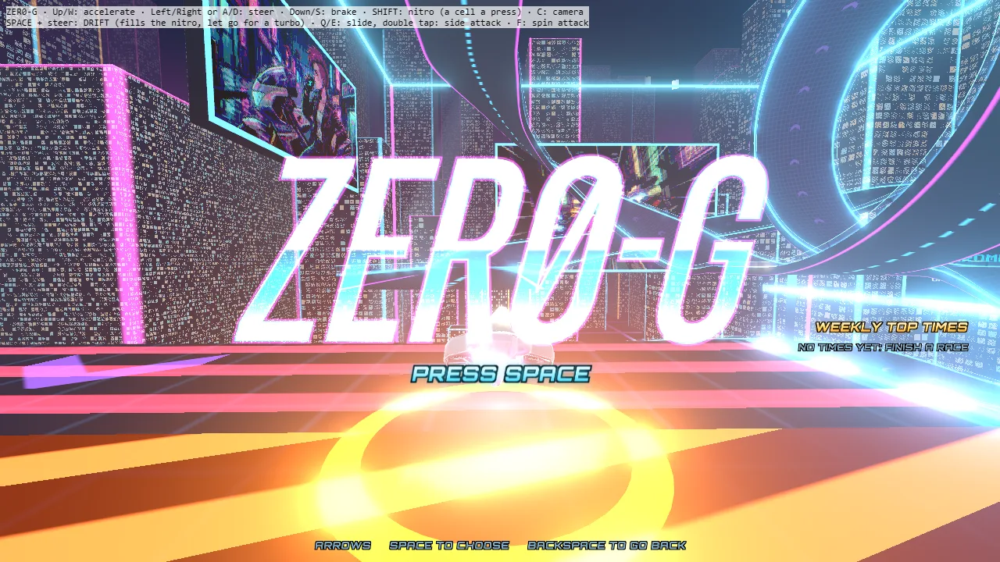

## What is in the game

- **Three cups of three courses.** The ZER0-G Cup over Neon City: NEON CITY (a loop, a corkscrew and a spiral), SKY PIPE (a pipe you ride round, walls and ceiling) and THE DRUM (a cylinder you ride on the outside). The NOVA CUP in deep space: PULSAR RUN, NEBULA KNOT and ORBIT GATE. The DUST CUP in a red desert: SCORCH STRIP, RUST MESA and SAND TWISTER. The later cups are longer and harder, with courses that climb round after round and come back down, hairpins, chicanes, open edges and canyons you can ride up the walls of. Open stretches without barriers, jumps you can fly off, and an instant respawn when you fall.
- **Eighteen machines**, each with its own pilot and stats (body, boost, grip, weight) and an engine setting from acceleration to top speed.
- **Three modes:** GRAND PRIX (pick a cup, then race its three courses for points), ONLINE RACE (a lobby with the other players in the lot, AI rivals fill the grid to 30) and TIME ATTACK (two laps alone). Classes NOVICE, STANDARD and EXPERT set the rivals' pace.
- **Three machines a race:** hit again with no energy left, or off the course with little left, and your machine blows apart; the spare comes out a couple of seconds later with full energy. The third wreck puts you out.
- **Drift and nitro:** a drift fills the nitro gauge and gives a turbo when you let go; flying clean at speed builds flow, up to a quarter more top speed.
- A weekly table of the best cup times, shown on the title screen.
- **MY MACHINE and the GALLERY** on the main menu: your own machine on its stand, and every player's machine with its pilot (the list is copied at each publish by `tools/gallery_snapshot.mjs`, since the sandbox cannot ask the server for it, and joined by the machines of whoever is in the lot).

| | |
|---|---|
| 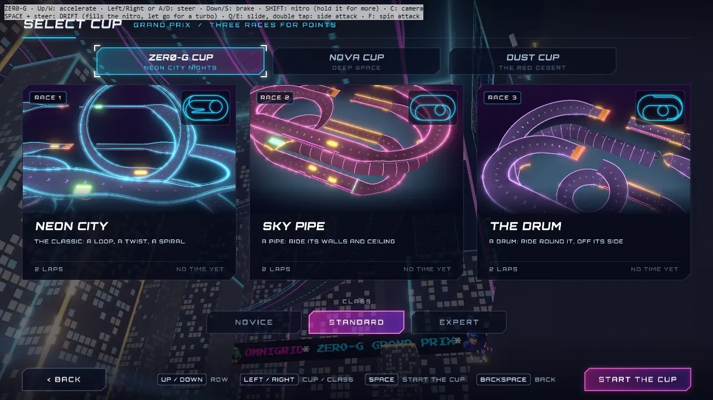 | 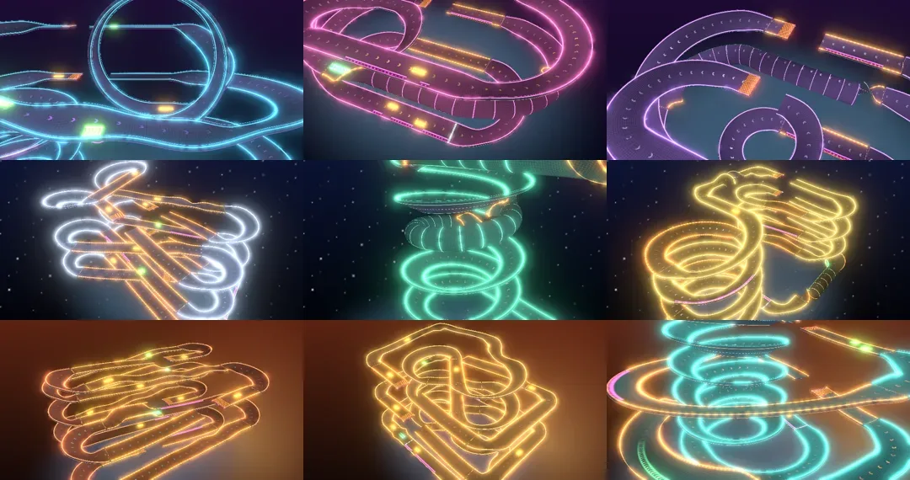 |
| 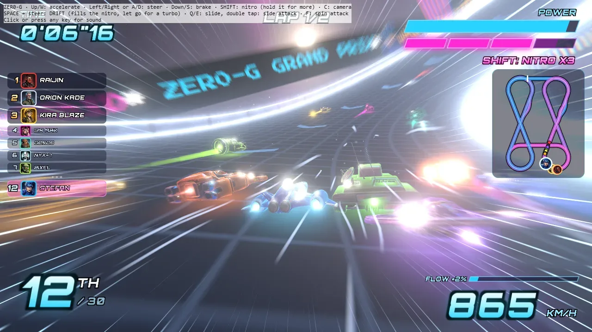 | 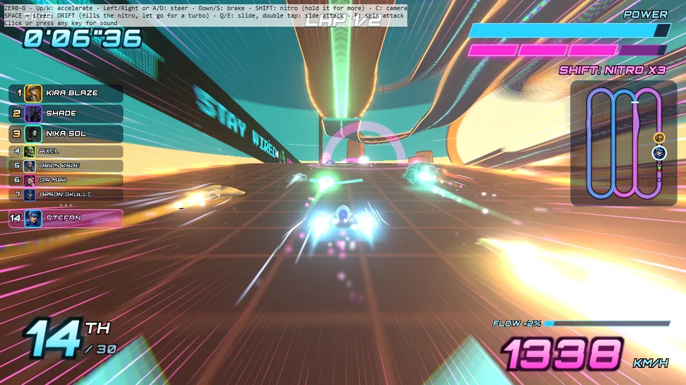 |
| 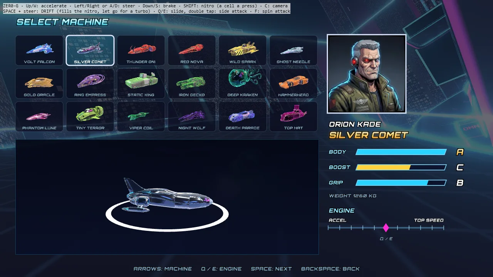 | 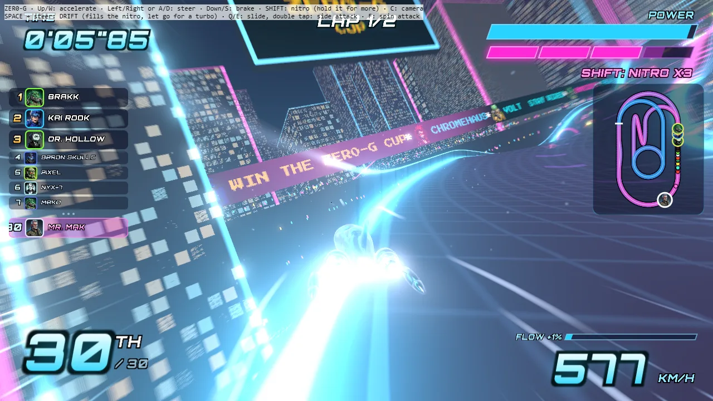 |
| 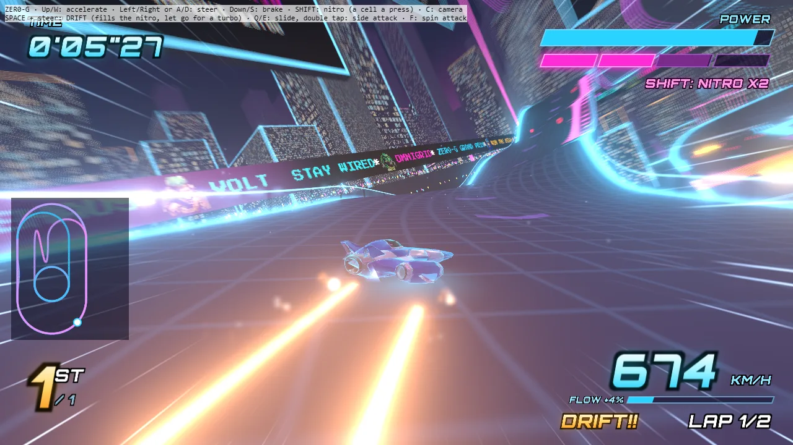 | 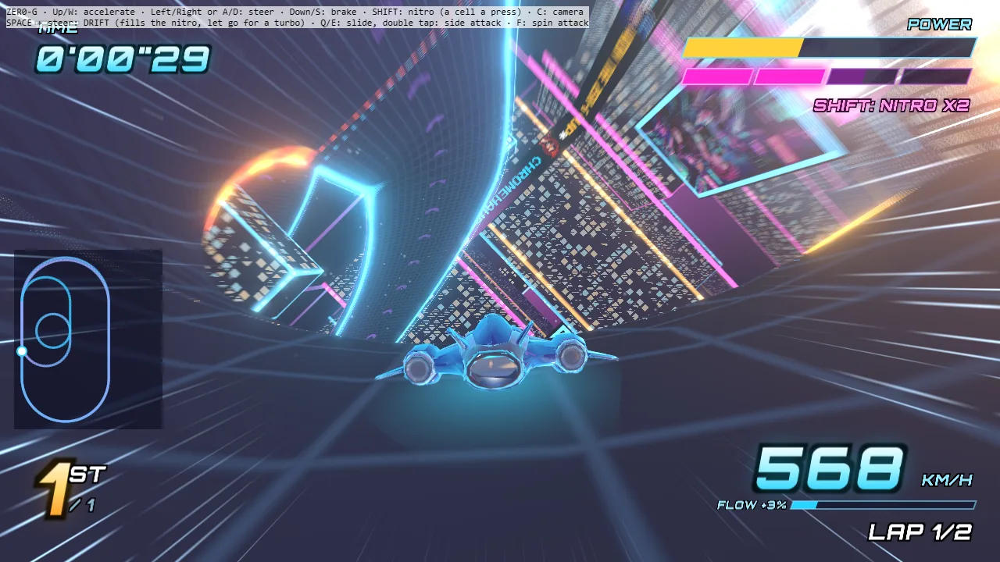 |
| 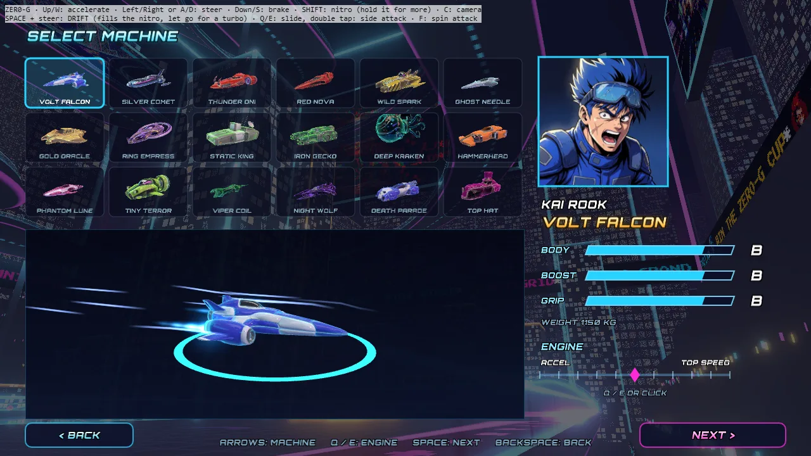 | 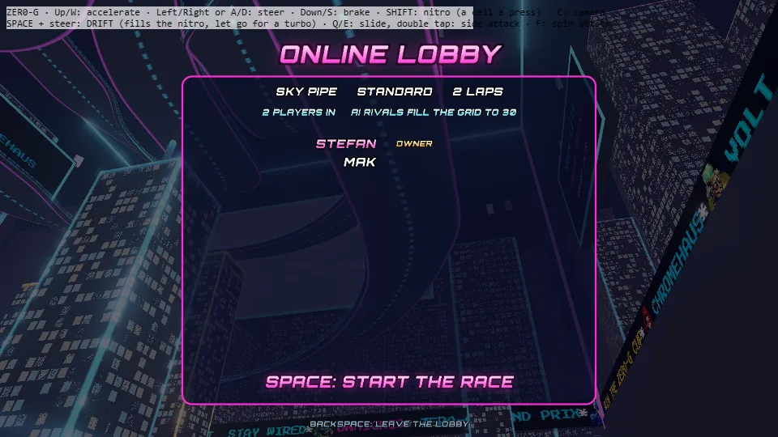 |

## Controls

| Key | Action |
|---|---|
| Up or W | accelerate |
| Left / Right or A / D | steer |
| Down or S | brake (in the air: nose down) |
| Space + steering | drift: steering moves its angle (on through straight to the other side), letting go of the steering holds it, straight for a moment ends it; let go of Space for a turbo |
| Shift | nitro: a cell per press; held, it fires whenever a cell is ready and burns another every second. A chain started with two cells in the gauge becomes a DOUBLE, with three or more a MEGA NITRO |
| Q / E | slide into a turn; double tap for a side attack |
| F | spin attack |
| C | near or far camera |
| Backspace twice | leave the race |

Menus: arrows or WASD to move, Space to choose, Backspace to go back, Q / E for the engine setting. The mouse works in the menus too: point at a card, a machine, a course or a button and click it.

## How it runs

ZER0-G is a Project 0 *experience*: the game runs in a sandboxed web worker with three.js r186 and the `p0` API (input, the screen overlay, a shared session for online play, scores and the weekly table). `experience/main.js` is the entry point and `experience/experience.json` is its manifest. There is no build step for the platform: the server bundles the folder when it is published.

Each course says which world it runs in (`env` in its JSON: the city, space or the desert), and `experience/environments.js` builds that world round it. `experience/clearance.js` keeps the stands, the screens, the ribbons and the director's cameras out of the road's way, so a course can use the whole lot. The course cards' pictures are rendered from the real track meshes when the game starts (`experience/heroes.js`).

The lot is also visible from the street as a smaller build (`lods/`): the arena as a diorama with sixteen machines racing the course on the world clock.

## Your own machine

Players can bring a machine of their own: their AI agent makes it as a Project 0 entity (a "machine" for the game
`zer0-g`) and it appears on their select screen, marked YOURS, and in online races. The rules are one module,
`experience/entity_rules.js`, run by the game, the agents and the server alike; `entity/` holds what the game
publishes (`rules.json`, the agents' `skill.md`, an example) and `entity/make_kind.mjs` writes them. An agent reads
the live skill at https://project0.city/api/games/zer0-g/skill.md.

## Running it locally

You need Node.js 20+, Python 3 and a Chromium browser.

```
npm install
npm run harness      # bundles the experience with a stand-in for the p0 API
npm run serve        # python -m http.server 8383
```

Then open http://localhost:8383/tools/harness/index.html and press any key. The stand-in (`tools/harness/mock.js`) is close enough for quick checks but it is not the real sandbox. Useful query parameters: `?auto=1` lets the AI drive your machine, `?pid=1&name=A` and `?pid=2&name=B` in two tabs share one online session.

A headless race with the game's own physics, for tuning:

```
node tools/sim.mjs [class] [laps]        # TRACK=2 for SKY PIPE, TRACK=3 for THE DRUM, HUMAN=1 adds a stand-in player
```

The Playwright scripts in `tools/` and `tools/sbx/` (screenshots, two-player online test, mouse test, drift check) drive Microsoft Edge on Windows. Change the `channel` option to run them on Chrome.

## Rebuilding the assets

| What | How |
|---|---|
| Courses | `python tools/track_design.py experience/assets/track1.json shots/track1.png neon`. The designs are `neon`, `pipe` and `drum` (tracks 1 to 3), `pulsar`, `nebula` and `orbit` (4 to 6), `scorch`, `mesa` and `twister` (7 to 9). Writes the course and a plan image, and checks the lot's box, clearance and curvature. |
| Machines | Tripo P2 meshes (see `sources/machines/`), then `blender -b --factory-startup --python tools/machine_prep.py -- <meshes dir> experience/assets/machines` turns, scales, decimates and bakes the glow maps. |
| UI, font, screens | `python tools/ui_prep.py`, `python tools/font_atlas.py`, `python tools/screens_atlas.py`, `node tools/screens_glsl.mjs` |
| Audio | `python tools/audio_pack.py` levels and packs the music and effects into `experience/assets/`. |
| Street build | `python tools/lod_textures.py`, then `blender -b --factory-startup --python tools/lods_build.py -- .` (uses `lods-src/street.blend`). |
| Sandbox bundle | `npm run sandbox` bundles the experience against the live sandbox's three.js, to test it in project0.city's own shell (`tools/sbx/review.mjs`). |

The raw generation outputs (the original meshes, concept images and audio takes) are not in this repository because of their size. `sources/` keeps the prompts and generation scripts that made them.

## Layout

```
experience/   the game: main.js, race.js (flight, AI, collisions, laps, nitro), track.js (courses and their meshes),
              city.js, boards.js (jumbotrons and ribbons), machines.js, camera.js, menus.js, hud.js, ui.js,
              online.js (the lobby and the shared race), fx.js, screenfx.js, audio.js; assets/ (machines, music,
              sound effects, UI, the three courses)
lods/         the street view of the lot (glTF, shaders, the clip script)
lods-src/     sources for the street view
tools/        course designer, asset preparation, headless sim, the p0 stand-in, test scripts
sources/      prompts and scripts used to generate the concepts, meshes, music, effects and announcer
skills/       the agent skills used for the art and sound (fal.ai, AssetHub)
docs/         screenshots
```

## Skills

The agent skills I used to make the concepts, machines and sounds are in [skills/](skills/README.md):
`fal-ai-generation` (Nano Banana images and ElevenLabs sounds through fal.ai), `assethub-production`
(Tripo P2 meshes through AssetHub) and `3d-production-routing`, which picks between them. Copy them into
`.claude/skills/` or `.agents/skills/` and bring your own keys. For building and publishing on Project 0 the
agent used Project 0's own skill: [project0.city/skill.md](https://project0.city/skill.md).

## Credits

Made by Stefan Vaskevich and Mr. Mak (his AI agent).

- Machine meshes: Tripo P2 through AssetHub
- Concepts and pilot portraits: Nano Banana
- Music: ElevenLabs Music and Sonilo
- Sound effects and announcer: ElevenLabs
- Fonts: Orbitron and Press Start 2P (SIL Open Font License, see `tools/fonts/`)
- Engine: [three.js](https://threejs.org)

## License

The code is MIT (`LICENSE`). The art and 3D models are CC BY-NC 4.0. The music, sound effects and announcer are included for this game only. Details are in `ASSETS-LICENSE.md`.

ZER0-G is a fan tribute and is not affiliated with Nintendo. F-Zero is a trademark of Nintendo.
